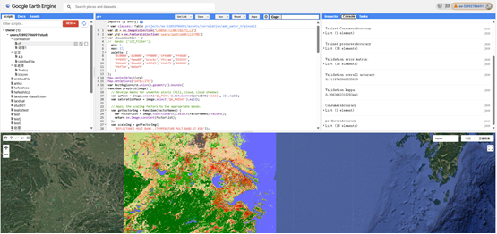

# Software Documentation: Exploring the Relationship Between Urban Landscape Patterns and NO2 Concentrations

This document aims to deeply explore the complex relationship between urban landscape patterns and NO2 concentrations, and proposes an innovative three-layer optimization framework to achieve scientific decoupling and optimization of influence zones. Using the Yangtze River Delta (YRD) urban agglomeration as a case study, the software leverages Local Climate Zone (LCZ) classification data and NO2 data from national air quality monitoring stations to address limitations in existing studies, such as scale concept confusion and arbitrary definitions of influence zones.

## Core Functionality
The software's core functionality is based on the following key technologies:

1. **LCZ Classification and Landscape Pattern Index Calculation**: Utilizes Landsat-8 imagery for high-precision LCZ classification and computes multi-scale landscape pattern indices to quantify urban morphological characteristics.
2. **Semivariogram Analysis**: Scientifically determines the optimal representation scale (distance and shape) of static LCZ landscape patterns, providing a data-driven baseline for subsequent analysis.
3. **Multi-Scale Geographically Weighted Ridge Regression (GWRR)**: Employs the GWRR model to identify the optimal process scale for explaining NO2 concentrations, effectively mitigating multicollinearity issues and revealing the spatial heterogeneity of landscape pattern impacts on NO2.
4. **Adaptive Directional Weighted Sector Influence Zone (ADWSIZ) Optimization**: Introduces the ADWSIZ model based on GWRR coefficients to dynamically optimize the shape of influence zones, adapting to the spatial heterogeneity of landscape functions, thereby significantly improving model explanatory power.

## Functional Description
The software involves various programs, languages, and platforms, and is described according to the sequence of functional modules. The functional design follows the three-layer analytical framework proposed in the paper: static scale delineation, process scale optimization, and directional shape correction. It also includes LCZ classification and data preprocessing functions. The following sections correspond to five main components:
1. LCZ Classification Implementation and Code
2. Influence Zone Raster Clipping and Landscape Pattern Index Calculation
3. Semivariogram Analysis Implementation and Code
4. GWRR Model Implementation and Code
5. ADWSIZ Implementation and Code

All source code is provided at the end of the document.

### 1. LCZ Classification
Annotated ground truth samples are uploaded to Google Earth Engine (GEE), and Landsat-8 imagery data is used to perform cloud and fog quality control filtering to obtain annual mean imagery. A random forest algorithm is employed to implement LCZ classification for the YRD region. The figure below shows the GEE operation interface and LCZ classification results.

**Figure 1**: GEE Interface for LCZ Classification

### 2. Influence Zone Raster Clipping and Landscape Pattern Index Calculation
After exporting the LCZ classification raster, the influence zone's range and shape are clipped based on corresponding monitoring stations. For example, rasters are clipped for 179 stations as centers, using circular shapes with radii from 1000m to 6000m at 500m intervals, resulting in 179 × 12 = 2148 files. This process is implemented using a Python environment in VSCode.

**Figure 2**: LCZ Raster Clipped Centered on Stations with Different Distances and Shapes

The clipped rasters are batch-processed in Fragstats 4.2-64 software, where selected landscape pattern indices are calculated. The figure below shows the Fragstats 4.2-64 interface for calculating landscape pattern indices.

**Figure 3**: Fragstats Interface for Landscape Pattern Index Calculation

### 3. Semivariogram Analysis
Stratified sampling is performed on the original LCZ raster, followed by semivariogram and directional semivariogram analysis on the sampled rasters. This process is implemented in a Python environment in VSCode. The figure below shows the VSCode interface for this analysis.

**Figure 4**: Python Environment for Semivariogram Analysis

### 4. GWRR Implementation
In a Python environment, GWRR modeling is conducted to compare influence zones at different distances. The figure below shows the GWRR modeling results for circular influence zones at various distances.

**Figure 5**: GWRR Modeling Results for Circular Influence Zones at Different Distances

### 5. ADWSIZ Implementation
The net influence in different directions for each station is calculated based on the formulas in the paper. The sector radius is adjusted according to the equal-area principle and the optimal process scale radius. Adaptive shape influence zone raster files are generated using the clipping code from method 2, and corresponding landscape pattern indices are calculated to produce CSV files. These are then compared with the optimal process scale influence zone using the GWRR modeling approach from method 4.

**Figure 6**: ADWSIZ Influence Calculation and Raster File Generation Process

**Figure 7**: ADWSIZ Influence and Raster File Results

## Source Code
The source code for the above functionalities is provided below, organized by section.

### 1. LCZ Classification
```javascript
// Define Landsat 8 Collection 2 Tier 1 Level 2 image dataset
var L8 = ee.ImageCollection("LANDSAT/LC08/C02/T1_L2");

// Define the Yangtze River Delta (YRD) study area FeatureCollection, a user-uploaded asset
var yrd = ee.FeatureCollection('users/lastrye00/LCZ/YRD');

// Define visualization parameters
var visualization = {
  min: 1, // Minimum display value
  max: 17, // Maximum display value, corresponding to 17 LCZ types
  palette: [
    '8c0000', 'd10000', 'ff0000', 'bf4d00', 'ff6600', // LCZ 1-5 (Built types)
    'ff9955', 'faee05', 'bcbcbc', 'ffccaa', '555555', // LCZ 6-10 (Built types)
    '006a00', '00aa00', '648525', 'b9db79', '000000', // LCZ A-E (Land cover types)
    'fbf7ae', '6a6aff' // LCZ F-G (Land cover types)
  ]
};

// Center the map on the YRD study area
Map.centerObject(yrd);

// Set the map basemap to satellite imagery
Map.setOptions('SATELLITE');

// Get the bounding box of the YRD study area's union geometry for image clipping and export
var RectRegion = yrd.union().geometry().bounds();

// Function to preprocess Landsat 8 Level 2 imagery
function prepSrL8(image) {
  var qaMask = image.select('QA_PIXEL').bitwiseAnd(parseInt('11111', 2)).eq(0);
  var saturationMask = image.select('QA_RADSAT').eq(0);
  var getFactorImg = function(factorNames) {
    var factorList = image.toDictionary().select(factorNames).values();
    return ee.Image.constant(factorList);
  };
  var scaleImg = getFactorImg([
    'REFLECTANCE_MULT_BAND_.|TEMPERATURE_MULT_BAND_ST_B10'
  ]);
  var offsetImg = getFactorImg([
    'REFLECTANCE_ADD_BAND_.|TEMPERATURE_ADD_BAND_ST_B10'
  ]);
  var scaled = image.select('SR_B.|ST_B10').multiply(scaleImg).add(offsetImg);
  return image.addBands(scaled, null, true)
    .updateMask(qaMask).updateMask(saturationMask);
}

// Define bands for classification
var bands = ['SR_B1', 'SR_B2', 'SR_B3', 'SR_B4', 'SR_B5', 'SR_B6', 'SR_B7'];

// Filter Landsat 8 image collection
var image = ee.ImageCollection('LANDSAT/LC08/C02/T1_L2')
  .filterBounds(RectRegion)
  .filterDate('2024-01-01', '2025-02-08')
  .map(prepSrL8)
  .select(bands)
  .mean();

// Define LCZ class labels from 1 to 17
var labels = ee.List.sequence(1, 17, 1);

// Define sample size per class
var nsamples = 300;

// Generate training sample points
var trainpoints = ee.FeatureCollection(labels.map(function(value) {
  return ee.FeatureCollection.randomPoints(classes.filterMetadata("Label", "equals", ee.Number(value)), nsamples, 111)
    .map(function(feacol) {
      return ee.Feature(feacol.geometry()).set("Label", ee.Number(value));
    });
})).flatten();

// Generate test sample points
var testpoints = ee.FeatureCollection(labels.map(function(value) {
  return ee.FeatureCollection.randomPoints(classes.filterMetadata("Label", "equals", ee.Number(value)), nsamples, 222)
    .map(function(feacol) {
      return ee.Feature(feacol.geometry()).set("Label", ee.Number(value));
    });
})).flatten();

// Define classification label property
var label = 'Label';

// Extract training sample data from imagery
var trainsample = image.sampleRegions({
  collection: trainpoints,
  scale: 500,
  tileScale: 1,
  geometries: false,
  properties: [label]
});

// Extract test sample data from imagery
var testsample = image.sampleRegions({
  collection: testpoints,
  scale: 500,
  tileScale: 1,
  geometries: false,
  properties: [label]
});

// Train Smile Random Forest classifier
var trained = ee.Classifier.smileRandomForest({
  numberOfTrees: 200,
  seed: 1
}).train(trainsample, "Label", bands);

// Calculate resubstitution accuracy
var trainAccuracy = trained.confusionMatrix();
print('Resubstitution error matrix: ', trainAccuracy);
print('Training overall accuracy: ', trainAccuracy.accuracy());
print('Training kappa: ', trainAccuracy.kappa());
print("Trained ConsumersAccuracy", trainAccuracy.consumersAccuracy());
print("Trained producersAccuracy", trainAccuracy.producersAccuracy());

// Classify validation data
var validated = testsample.classify(trained);

// Calculate validation error matrix
var testAccuracy = validated.errorMatrix('Label', 'classification');
print('Validation error matrix: ', testAccuracy);
print('Validation overall accuracy: ', testAccuracy.accuracy());
print('Validation kappa: ', testAccuracy.kappa());
print("Validation ConsumersAccuracy", testAccuracy.consumersAccuracy());
print("Validation producersAccuracy", testAccuracy.producersAccuracy());

// Classify the entire image
var classified = image.classify(trained);

// Add classification results to the map, clipped to the study area boundary
Map.addLayer(classified.clip(RectRegion), visualization, "classified2");
```

### 2. Influence Zone Raster Clipping
```python
import rasterio
from rasterio.mask import mask
import geopandas as gpd
import shapely.geometry as sg
import os

# Define input file paths
shp_path = r"E:\data\v2\lcz\sites_shp_2024_mean2.shp"
landuse_data = r"E:\data\v2.3\lcz_yrd2_30m.tif"

# Ensure output folder exists
output_folder = r"E:\30m\circle1-62"
if not os.path.exists(output_folder):
    os.makedirs(output_folder)

# Read vector data
gdf = gpd.read_file(shp_path)
count = 0

# Read raster data
with rasterio.open(landuse_data) as src:
    for index, row in gdf.iterrows():
        site = row['Site']
        geometry = row.geometry
        for radius in [500, 1000, 1500, 2000, 2500, 3000, 3500, 4000, 4500, 5000, 5500, 6000]:
            buffer_geometry = geometry.buffer(radius)
            landuse_clip = os.path.join(output_folder, f"{site}_{radius}m.tif")
            try:
                out_image, out_transform = mask(src, [sg.mapping(buffer_geometry)], crop=True)
                out_meta = src.meta.copy()
                out_meta.update({
                    "driver": "GTiff",
                    "height": out_image.shape[1],
                    "width": out_image.shape[2],
                    "transform": out_transform
                })
                with rasterio.open(landuse_clip, "w", **out_meta) as dest:
                    dest.write(out_image)
                    count += 1
                    print(f"Clipped {site}_{radius}m.tif completed.", count)
            except ValueError:
                print(f"No valid data found for clipping {site}_{radius}m.tif.")
```

### 3. Semivariogram Analysis
```python
import rasterio
import numpy as np
import matplotlib.pyplot as plt
from skgstat import Variogram
import skgstat as skg
from tabulate import tabulate
import gc

plt.rcParams.update({
    'figure.dpi': 300,
    'font.family': 'Times New Roman',
    'font.size': 12,
    'axes.labelsize': 14,
    'axes.labelweight': 'bold',
    'xtick.labelsize': 12,
    'ytick.labelsize': 12,
    'axes.spines.top': True,
    'axes.spines.right': True
})

def load_geotiff(path):
    with rasterio.open(path) as src:
        data = src.read(1)
        transform = src.transform
        nodata = src.nodata
    return data, transform, nodata

def preprocess_data(data, nodata):
    data = np.where(data == nodata, np.nan, data)
    mask = ~np.isnan(data)
    rows, cols = np.where(mask)
    values = data[rows, cols]
    return rows, cols, values

def calculate_coordinates(rows, cols, transform):
    x_coords, y_coords = transform * (cols + 0.5, rows + 0.5)
    return np.column_stack((x_coords, y_coords))

def downsample_data(coordinates, values, sample_size=10000):
    if len(coordinates) > sample_size:
        np.random.seed(5)
        indices = np.random.choice(len(coordinates), sample_size, replace=False)
        return coordinates[indices], values[indices]
    return coordinates, values

def fit_variogram_models(coordinates, values):
    models = ['spherical', 'exponential', 'gaussian', 'matern']
    results = []
    for model in models:
        try:
            V = Variogram(
                coordinates=coordinates,
                values=values,
                n_lags=50,
                maxlag=0.8,
                model=model,
                estimator='matheron'
            )
            params = V.parameters
            pred = V.model(V.bins, *params)
            exp = V.experimental
            mask = ~np.isnan(exp)
            exp = exp[mask]
            pred = pred[mask]
            ss_res = np.sum((exp - pred) ** 2)
            ss_tot = np.sum((exp - np.mean(exp)) ** 2)
            r_squared = 1 - (ss_res / ss_tot) if ss_tot != 0 else np.nan
            result = {
                'model': model,
                'nugget': params[2],
                'range': params[0],
                'sill': params[1],
                'r_squared': r_squared,
                'variogram': V,
                'sse': ss_res
            }
            if model == 'matern' and len(params) > 3:
                result['nu'] = params[3]
            results.append(result)
        except Exception as e:
            print(f"Error fitting {model} model: {str(e)}")
            continue
    return results

def plot_comparison(results, N):
    plt.figure(figsize=(6.8, 5.5))
    V = results[0]['variogram']
    plt.scatter(V.bins, V.experimental, color='k', alpha=0.5, label='Experimental', zorder=5, s=20)
    x_smooth = np.linspace(0, V.bins.max(), 300)
    colors = ['red', 'blue', 'green', 'purple']
    linestyles = ['-', '--', '-.', ':']
    for i, res in enumerate(results):
        V = res['variogram']
        y_smooth = V.model(x_smooth, *V.parameters)
        plt.plot(x_smooth, y_smooth,
                 color=colors[i],
                 linestyle=linestyles[i],
                 linewidth=2.5,
                 label=f"{res['model'].capitalize()}\nR²={res['r_squared']:.2f}, SSE={res['sse']:.2f}")
    plt.xlabel('Lag Distance (m)', fontweight='bold', fontsize=12)
    plt.ylabel('Semivariance', fontweight='bold', fontsize=12)
    plt.legend(frameon=False, loc='lower right', fontsize=10)
    plt.grid(True, linestyle='--', color='gray', alpha=0.5)
    plt.axvline(x=1098.22, color='gray', linestyle='--', alpha=0.5)
    plt.text(1015, plt.ylim()[1]*0.65, '1098.22m', rotation=90, fontsize=10)
    plt.tick_params(axis='both', which='major', labelsize=11)
    plt.tight_layout()
    plt.savefig('semiva_plot_a.png', dpi=300, bbox_inches='tight')
    plt.show()

def generate_results_table(results):
    table = []
    headers = ['Model', 'Nugget', 'Range (m)', 'Sill', 'R²', 'SSE', 'Nu (Matern)']
    for res in results:
        row = [
            res['model'].capitalize(),
            f"{res['nugget']:.2f}",
            f"{res['range']:.2f}",
            f"{res['sill']:.2f}",
            f"{res['r_squared']:.2f}",
            f"{res['sse']:.2f}",
            f"{res.get('nu', '-')}"
        ]
        table.append(row)
    print("\nVariogram Model Comparison")
    print(tabulate(table, headers=headers, tablefmt="grid", stralign="center", numalign="center"))

if __name__ == "__main__":
    tif_path = r"E:\data\v2.3\random_crops\stratified_sample.tif"
    data, transform, nodata = load_geotiff(tif_path)
    rows, cols, values = preprocess_data(data, nodata)
    coordinates = calculate_coordinates(rows, cols, transform)
    coordinates, values = downsample_data(coordinates, values, sample_size=10000)
    del data, rows, cols
    gc.collect()
    results = fit_variogram_models(coordinates, values)
    generate_results_table(results)
    plot_comparison(results, N=len(coordinates))
```

### 4. Directional Semivariogram Analysis
```python
import rasterio
import numpy as np
import matplotlib.pyplot as plt
from skgstat import Variogram, DirectionalVariogram
import skgstat as skg
from tabulate import tabulate
import gc
import pandas as pd
from scipy.stats import kruskal
from scikit_posthocs import posthoc_dunn
import seaborn as sns

plt.rcParams.update({
    'figure.dpi': 300,
    'font.family': 'Times New Roman',
    'font.size': 12,
    'axes.labelsize': 14,
    'axes.labelweight': 'bold',
    'xtick.labelsize': 12,
    'ytick.labelsize': 12,
    'axes.spines.top': True,
    'axes.spines.right': True
})

def load_geotiff(path):
    with rasterio.open(path) as src:
        data = src.read(1)
        transform = src.transform
        nodata = src.nodata
    return data, transform, nodata

def preprocess_data(data, nodata):
    data = np.where(data == nodata, np.nan, data)
    mask = ~np.isnan(data)
    rows, cols = np.where(mask)
    values = data[rows, cols]
    return rows, cols, values

def calculate_coordinates(rows, cols, transform):
    x_coords, y_coords = transform * (cols + 0.5, rows + 0.5)
    return np.column_stack((x_coords, y_coords))

def downsample_data(coordinates, values, sample_size=10000):
    if len(coordinates) > sample_size:
        np.random.seed(5)
        indices = np.random.choice(len(coordinates), sample_size, replace=False)
        return coordinates[indices], values[indices]
    return coordinates, values

def fit_variogram_models(coordinates, values):
    models = ['spherical', 'exponential', 'gaussian', 'matern']
    results = []
    for model in models:
        try:
            V = Variogram(
                coordinates=coordinates,
                values=values,
                n_lags=50,
                maxlag=0.8,
                model=model,
                estimator='matheron'
            )
            params = V.parameters
            pred = V.model(V.bins, *params)
            exp = V.experimental
            mask = ~np.isnan(exp)
            exp = exp[mask]
            pred = pred[mask]
            ss_res = np.sum((exp - pred) ** 2)
            ss_tot = np.sum((exp - np.mean(exp)) ** 2)
            r_squared = 1 - (ss_res / ss_tot) if ss_tot != 0 else np.nan
            result = {
                'model': model,
                'nugget': params[2],
                'range': params[0],
                'sill': params[1],
                'r_squared': r_squared,
                'variogram': V,
                'sse': ss_res
            }
            if model == 'matern' and len(params) > 3:
                result['nu'] = params[3]
            results.append(result)
        except Exception as e:
            print(f"Error fitting {model} model: {str(e)}")
            continue
    return results

def plot_comparison(results, N):
    plt.figure(figsize=(6.8, 5.5))
    V = results[0]['variogram']
    plt.scatter(V.bins, V.experimental, color='k', alpha=0.5, label='Experimental', zorder=5, s=20)
    x_smooth = np.linspace(0, V.bins.max(), 300)
    colors = ['red', 'blue', 'green', 'purple']
    linestyles = ['-', '--', '-.', ':']
    for i, res in enumerate(results):
        V = res['variogram']
        y_smooth = V.model(x_smooth, *V.parameters)
        plt.plot(x_smooth, y_smooth,
                 color=colors[i],
                 linestyle=linestyles[i],
                 linewidth=2.5,
                 label=f"{res['model'].capitalize()}\nR²={res['r_squared']:.2f}, SSE={res['sse']:.2f}")
    plt.xlabel('Lag Distance (m)', fontweight='bold', fontsize=12)
    plt.ylabel('Semivariance', fontweight='bold', fontsize=12)
    plt.legend(frameon=False, loc='lower right', fontsize=10)
    plt.grid(True, linestyle='--', color='gray', alpha=0.5)
    plt.axvline(x=1098.22, color='gray', linestyle='--', alpha=0.5)
    plt.text(1015, plt.ylim()[1]*0.65, '1098.22m', rotation=90, fontsize=10)
    plt.tick_params(axis='both', which='major', labelsize=11)
    plt.tight_layout()
    plt.savefig('semiva_plot_a.png', dpi=300, bbox_inches='tight')
    plt.show()

def generate_results_table(results):
    table = []
    headers = ['Model', 'Nugget', 'Range (m)', 'Sill', 'R²', 'SSE', 'Nu (Matern)']
    for res in results:
        row = [
            res['model'].capitalize(),
            f"{res['nugget']:.2f}",
            f"{res['range']:.2f}",
            f"{res['sill']:.2f}",
            f"{res['r_squared']:.2f}",
            f"{res['sse']:.2f}",
            f"{res.get('nu', '-')}"
        ]
        table.append(row)
    print("\nVariogram Model Comparison")
    print(tabulate(table, headers=headers, tablefmt="grid", stralign="center", numalign="center"))

if __name__ == "__main__":
    tif_path = r"E:\data\v2.3\random_crops\stratified_sample.tif"
    data, transform, nodata = load_geotiff(tif_path)
    rows, cols, values = preprocess_data(data, nodata)
    coordinates = calculate_coordinates(rows, cols, transform)
    coordinates, values = downsample_data(coordinates, values, sample_size=10000)
    del data, rows, cols
    gc.collect()
    results = fit_variogram_models(coordinates, values)
    generate_results_table(results)
    plot_comparison(results, N=len(coordinates))
    Vnorth = DirectionalVariogram(coordinates, values, azimuth=90, tolerance=10, maxlag=0.8, n_lags=20)
    Veast = DirectionalVariogram(coordinates, values, azimuth=0, tolerance=10, maxlag=0.8, n_lags=20)
    Vnortheast = DirectionalVariogram(coordinates, values, azimuth=45, tolerance=10, maxlag=0.8, n_lags=20)
    Vsoutheast = DirectionalVariogram(coordinates, values, azimuth=135, tolerance=10, maxlag=0.8, n_lags=20)
    def get_value_at_distance(variogram, target_distance=1000):
        bins = variogram.bins
        values = variogram.experimental
        if not bins.size:
            return np.nan
        idx = np.abs(bins - target_distance).argmin()
        return values[idx]
    north_value = get_value_at_distance(Vnorth)
    east_value = get_value_at_distance(Veast)
    northeast_value = get_value_at_distance(Vnortheast)
    southeast_value = get_value_at_distance(Vsoutheast)
    def create_directional_samples(coordinates, values, azimuth, tolerance, n_samples=30, sample_size=500):
        samples = []
        for _ in range(n_samples):
            indices = np.random.choice(len(coordinates), sample_size, replace=False)
            subset_coords = coordinates[indices]
            subset_values = values[indices]
            vario = DirectionalVariogram(subset_coords, subset_values, azimuth=azimuth, tolerance=tolerance, maxlag=0.8, n_lags=20)
            value = get_value_at_distance(vario)
            if not np.isnan(value):
                samples.append(value)
        return np.array(samples)
    np.random.seed(42)
    north_samples = create_directional_samples(coordinates, values, 90, 10)
    east_samples = create_directional_samples(coordinates, values, 0, 10)
    northeast_samples = create_directional_samples(coordinates, values, 45, 10)
    southeast_samples = create_directional_samples(coordinates, values, 135, 10)
    statistic, p_value = kruskal(north_samples, east_samples, northeast_samples, southeast_samples)
    if p_value < 0.05:
        posthoc = posthoc_dunn([north_samples, east_samples, northeast_samples, southeast_samples], p_adjust='bonferroni')
        posthoc.columns = ['North', 'East', 'Northeast', 'Southeast']
        posthoc.index = ['North', 'East', 'Northeast', 'Southeast']
    else:
        posthoc = None
    plt.figure(figsize=(6.8, 5.5))
    plt.plot(Vnorth.bins, Vnorth.experimental, 'o-', color='red', label='North-South', markersize=6, linewidth=1.5)
    plt.plot(Veast.bins, Veast.experimental, 's-', color='blue', label='East-West', markersize=6, linewidth=1.5)
    plt.plot(Vnortheast.bins, Vnortheast.experimental, 'd-', color='green', label='Northeast', markersize=6, linewidth=1.5)
    plt.plot(Vsoutheast.bins, Vsoutheast.experimental, '^-', color='purple', label='Southeast', markersize=6, linewidth=1.5)
    plt.axvline(x=1000, color='gray', linestyle='--', alpha=0.5)
    plt.text(1010, plt.ylim()[1]*0.9, '1000m', rotation=90, fontsize=10)
    plt.xlabel('Lag Distance (m)', fontsize=12)
    plt.ylabel('Semivariance', fontsize=12)
    plt.legend(frameon=False, facecolor='none', loc='lower right', fontsize=10)
    plt.grid(True, linestyle='--', alpha=0.7)
    plt.tick_params(axis='both', which='major', labelsize=11)
    plt.tight_layout()
    plt.savefig('semiva_plot_b1.png', dpi=300, bbox_inches='tight')
    plt.show()
    plt.figure(figsize=(6.8, 5.0))
    sns.boxplot(data=[north_samples, east_samples, northeast_samples, southeast_samples])
    plt.xticks([0, 1, 2, 3], ['North', 'East', 'Northeast', 'Southeast'], fontsize=12)
    plt.ylabel('Semivariance at 1000m', fontsize=12)
    plt.title(f'Comparison of Semivariance at 1000m\nKruskal-Wallis p-value: {p_value:.4f}', fontsize=14)
    plt.grid(True, linestyle='--', alpha=0.7)
    if p_value < 0.05:
        plt.text(1.5, max([max(s) for s in [north_samples, east_samples, northeast_samples, southeast_samples]])*1.05,
                 f'Kruskal-Wallis test: p={p_value:.4f}*', ha='center', fontsize=12)
    else:
        plt.text(1.5, max([max(s) for s in [north_samples, east_samples, northeast_samples, southeast_samples]])*1.05,
                 f'Kruskal-Wallis test: p={p_value:.4f}', ha='center', fontsize=12)
    plt.tick_params(axis='both', which='major', labelsize=11)
    plt.tight_layout()
    plt.savefig('semiva_plot_b2.png', dpi=300, bbox_inches='tight')
    plt.show()
    print(f"Kruskal-Wallis test statistic: {statistic:.4f}")
    print(f"p-value: {p_value:.4f}")
    if posthoc is not None:
        print("\nDunn's multiple comparison results (adjusted p-values):")
        print(posthoc)
        significant_pairs = []
        directions = ['North', 'East', 'Northeast', 'Southeast']
        for i in range(len(directions)):
            for j in range(i + 1, len(directions)):
                if posthoc.iloc[i, j] < 0.05:
                    significant_pairs.append(f"{directions[i]} vs {directions[j]}: p={posthoc.iloc[i, j]:.4f}")
        if significant_pairs:
            print("\nSignificant directional pairs:")
            for pair in significant_pairs:
                print(pair)
        else:
            print("\nNo significant differences between directional pairs")
```

### 5. GWRR Implementation
```python
import pandas as pd
import numpy as np
import matplotlib.pyplot as plt
from mgwr.gwr import GWR
from mgwr.sel_bw import Sel_BW
from sklearn.preprocessing import StandardScaler
from sklearn.metrics import mean_squared_error
import warnings
warnings.filterwarnings("ignore", category=UserWarning)

plt.rcParams.update({
    'font.family': 'serif',
    'font.serif': ['Times New Roman'],
    'font.size': 10,
    'axes.labelsize': 10,
    'axes.titlesize': 12,
    'legend.fontsize': 8
})

df = pd.read_csv(r"E:\30m\landscape_pattern_indices\circle1-62\sites.csv")
coords = df[['Longitude', 'Latitude']].values
target = 'NO2_24h'
scales = ['500m', '1000m', '1500m', '2000m', '2500m', '3000m', '3500m', '4000m', '4500m', '5000m', '5500m', '6000m']
results_df = pd.DataFrame(columns=['Scale', 'R2', 'Adj_R2', 'AICc', 'RMSE', 'Best_Lambda', 'Used_Vars'])

for scale in scales:
    print(f"\n==== Processing {scale} buffer ====")
    scale_vars = [col for col in df.columns if col.endswith(f"_{scale}")]
    df_clean = df.dropna(subset=scale_vars + [target])
    X = df_clean[scale_vars].values
    y = df_clean[target].values.reshape(-1, 1)
    coords_clean = df_clean[['Longitude', 'Latitude']].values
    n_samples, n_features = X.shape
    used_vars = scale_vars
    X = df_clean[used_vars].values
    n_features = X.shape[1]
    print(f"Used variables: {used_vars}, Number of features: {n_features}")
    scaler = StandardScaler()
    X_scaled = scaler.fit_transform(X)
    selector = Sel_BW(coords_clean, y, X_scaled, fixed=False)
    best_bw = selector.search(criterion='AICc', verbose=False)
    print(f"Best bandwidth: {best_bw:.2f}")
    lambda_grid = np.logspace(-3, 3, 20)
    best_lambda = None
    best_rmse = np.inf
    for lambda_val in lambda_grid:
        model = GWR(coords_clean, y, X_scaled, bw=best_bw, fixed=False, ridge=lambda_val)
        results = model.fit()
        current_rmse = np.sqrt(mean_squared_error(y, results.predictions))
        if current_rmse < best_rmse:
            best_rmse = current_rmse
            best_lambda = lambda_val
    print(f"Best lambda: {best_lambda:.4f}, Corresponding RMSE: {best_rmse:.3f}")
    final_model = GWR(coords_clean, y, X_scaled, bw=best_bw, fixed=False, ridge=best_lambda)
    final_results = final_model.fit()
    r2 = final_results.R2
    adj_r2 = final_results.adj_R2
    aicc = final_results.aicc
    rmse = np.sqrt(mean_squared_error(y, final_results.predictions))
    temp_df = pd.DataFrame({
        'Scale': [scale],
        'R2': [r2],
        'Adj_R2': [adj_r2],
        'AICc': [aicc],
        'RMSE': [rmse],
        'Best_Lambda': [best_lambda],
        'Used_Vars': [','.join(used_vars)]
    })
    results_df = pd.concat([results_df, temp_df], ignore_index=True)

fig, axes = plt.subplots(2, 2, figsize=(12, 10))
metrics = [('R2', 'skyblue'), ('Adj_R2', 'lightgreen'), ('AICc', 'salmon'), ('RMSE', 'gold')]
for ax, (metric, color) in zip(axes.flatten(), metrics):
    ax.bar(results_df['Scale'], results_df[metric], color=color)
    ax.set_title(f'{metric} Comparison')
    if metric in ['R2', 'Adj_R2']:
        ax.set_ylim(0, 1)
    elif metric == 'RMSE':
        ax.set_ylim(bottom=0)
plt.tight_layout()
plt.show()

print("\nGWRR Model Performance Summary:")
print(results_df[['Scale', 'R2', 'Adj_R2', 'AICc', 'RMSE', 'Best_Lambda']].round(3))
best_idx = results_df['Adj_R2'].idxmax()
print(f"\nBest Model: Scale={results_df.loc[best_idx,'Scale']}, Adjusted R²={results_df.loc[best_idx,'Adj_R2']:.3f}")
print(f"Used variables: {results_df.loc[best_idx,'Used_Vars']}")
```

### 6. ADWSIZ Influence Calculation, Sector Radius Adjustment, and Adaptive Shape Raster Clipping
```python
import numpy as np
import pandas as pd
import rasterio
from rasterio.mask import mask
import geopandas as gpd
from shapely.geometry import Polygon, Point
from shapely.ops import transform, unary_union
from pyproj import Transformer
import math
import os
from tqdm import tqdm

lcz_path = r"E:\data\v2.3\lcz_yrd2_30m_fill0.tif"
with rasterio.open(lcz_path) as src:
    lcz_data = src.read(1)
    lcz_meta = src.meta.copy()
    lcz_crs = src.crs
    lcz_transform = src.transform
    pixel_width = lcz_meta['transform'].a
    pixel_height = abs(lcz_meta['transform'].e)

gwrr_data = pd.read_csv(r"E:\30m\landscape_pattern_indices\adaptive\GWRR_4000m_PLAND_coefficients.csv", encoding='utf-8')
gdf = gpd.GeoDataFrame(
    gwrr_data,
    geometry=[Point(lon, lat) for lon, lat in zip(gwrr_data['Longitude'], gwrr_data['Latitude'])],
    crs="EPSG:4326"
)
gdf_utm = gdf.to_crs("EPSG:32651")

directions = [
    ("East", 337.5, 22.5),
    ("Northeast", 22.5, 67.5),
    ("North", 67.5, 112.5),
    ("Northwest", 112.5, 157.5),
    ("West", 157.5, 202.5),
    ("Southwest", 202.5, 247.5),
    ("South", 247.5, 292.5),
    ("Southeast", 292.5, 337.5)
]

def create_sector(center, radius, start_angle, end_angle):
    start_angle = start_angle % 360
    end_angle = end_angle % 360
    if start_angle > end_angle:
        points1 = []
        for angle in np.linspace(start_angle, 360, 50):
            rad = math.radians(angle)
            points1.append((center.x + radius * math.cos(rad), center.y + radius * math.sin(rad)))
        points2 = []
        for angle in np.linspace(0, end_angle, 50):
            rad = math.radians(angle)
            points2.append((center.x + radius * math.cos(rad), center.y + radius * math.sin(rad)))
        points = points1 + points2 + [(center.x, center.y)]
        return Polygon(points)
    points = []
    for angle in np.linspace(start_angle, end_angle, 100):
        rad = math.radians(angle)
        x = center.x + radius * math.cos(rad)
        y = center.y + radius * math.sin(rad)
        points.append((x, y))
    points.append((center.x, center.y))
    return Polygon(points)

def calculate_lcz_area(sector, lcz_data, transform):
    lcz_area = {i: 0 for i in range(1, 18)}
    minx, miny, maxx, maxy = sector.bounds
    row_min, col_min = rasterio.transform.rowcol(transform, minx, maxy)
    row_max, col_max = rasterio.transform.rowcol(transform, maxx, miny)
    for row in range(row_min, row_max + 1):
        for col in range(col_min, col_max + 1):
            if 0 <= row < lcz_data.shape[0] and 0 <= col < lcz_data.shape[1]:
                x, y = rasterio.transform.xy(transform, row, col)
                pixel = Polygon([
                    (x - pixel_width/2, y - pixel_height/2),
                    (x + pixel_width/2, y - pixel_height/2),
                    (x + pixel_width/2, y + pixel_height/2),
                    (x - pixel_width/2, y + pixel_height/2)
                ])
                intersection = pixel.intersection(sector)
                if not intersection.is_empty:
                    lcz_type = lcz_data[row, col]
                    if 1 <= lcz_type <= 17:
                        lcz_area[lcz_type] += intersection.area
    return lcz_area

def calculate_directional_impact(station_row, center, base_radius, directions, lcz_data, transform):
    circle_area = math.pi * base_radius ** 2
    direction_impacts = {}
    for dir_name, start_angle, end_angle in directions:
        sector = create_sector(center, base_radius, start_angle, end_angle)
        lcz_area = calculate_lcz_area(sector, lcz_data, transform)
        impact = 0
        for lcz_type in range(1, 18):
            if lcz_area[lcz_type] > 0:
                pland_coef = station_row[f'PLAND_{lcz_type}_4000m']
                impact += pland_coef * (lcz_area[lcz_type] / circle_area)
        direction_impacts[dir_name] = {
            'impact': impact,
            'lcz_area': lcz_area,
            'sector': sector,
            'start_angle': start_angle,
            'end_angle': end_angle
        }
    total_impact = sum(abs(dir_data['impact']) for dir_data in direction_impacts.values())
    if total_impact <= 0:
        total_impact = 1e-10
    norm_impacts = {dir_name: abs(dir_data['impact']) / total_impact for dir_name, dir_data in direction_impacts.items()}
    target_areas = {dir_name: norm_impacts[dir_name] * circle_area for dir_name in direction_impacts.keys()}
    original_sector_area = circle_area / 8
    adjusted_sectors = []
    for dir_name, dir_data in direction_impacts.items():
        target_area = target_areas[dir_name]
        adjusted_radius = base_radius * math.sqrt(target_area / original_sector_area)
        start_angle, end_angle = dir_data['start_angle'], dir_data['end_angle']
        adjusted_sector = create_sector(center, adjusted_radius, start_angle, end_angle)
        adjusted_sectors.append({
            'name': dir_name,
            'sector': adjusted_sector,
            'impact': dir_data['impact'],
            'radius': adjusted_radius,
            'target_area': target_area,
            'actual_area': adjusted_sector.area,
            'lcz_area': dir_data['lcz_area']
        })
    total_adjusted_area = sum(s['actual_area'] for s in adjusted_sectors)
    print(f"Original circle area: {circle_area/1e6:.4f} km², Adjusted total area: {total_adjusted_area/1e6:.4f} km²")
    return adjusted_sectors

def clip_and_save_tiff(merged_sector, station_code, lcz_path, output_dir):
    from shapely.geometry import mapping
    if not merged_sector.is_valid:
        merged_sector = merged_sector.buffer(0)
    sector_geojson = [mapping(merged_sector)]
    with rasterio.open(lcz_path) as src:
        try:
            out_image, out_transform = mask(src, sector_geojson, crop=True, all_touched=True)
            if out_image.size == 0:
                bounds = merged_sector.bounds
                print(f"Warning: {station_code} clipping result is empty, bounds: {bounds}")
                raise ValueError("Clipping result is empty")
            out_meta = src.meta.copy()
            out_meta.update({
                'driver': 'GTiff',
                'height': out_image.shape[1],
                'width': out_image.shape[2],
                'transform': out_transform,
                'crs': src.crs
            })
            output_path = os.path.join(output_dir, f"{station_code}_sector.tif")
            with rasterio.open(output_path, "w", **out_meta) as dst:
                dst.write(out_image)
            return output_path
        except Exception as e:
            print(f"Clipping failed - Station: {station_code}, Error: {str(e)}")
            return None

output_dir = r"E:\30m\landscape_pattern_indices\sector_TIFF_results_adjusted"
os.makedirs(output_dir, exist_ok=True)
processed_count = 0
for i, row in tqdm(gdf_utm.iterrows(), total=len(gdf_utm), desc="Processing stations"):
    station_code = row['Site']
    center = row.geometry
    base_radius = 4000
    try:
        adjusted_sectors = calculate_directional_impact(row, center, base_radius, directions, lcz_data, lcz_transform)
        east_sector = next(s for s in adjusted_sectors if s['name'] == 'East')
        print(f"Station {station_code}: East direction impact={east_sector['impact']:.6f}, radius={east_sector['radius']:.2f}m")
        stats = {
            'Site': station_code,
            'Original_circle_area(km²)': math.pi * base_radius ** 2 / 1e6,
            'Total_impact': sum(abs(s['impact']) for s in adjusted_sectors)
        }
        for s in adjusted_sectors:
            stats[f"{s['name']}_impact"] = s['impact']
            stats[f"{s['name']}_normalized_impact"] = abs(s['impact']) / max(stats['Total_impact'], 1e-10)
            stats[f"{s['name']}_radius(m)"] = s['radius']
            stats[f"{s['name']}_area(km²)"] = s['actual_area'] / 1e6
            for lcz_type in range(1, 18):
                lcz_area = s['lcz_area'].get(lcz_type, 0)
                stats[f"{s['name']}_LCZ{lcz_type}_area(km²)"] = lcz_area / 1e6
                stats[f"{s['name']}_LCZ{lcz_type}_proportion"] = lcz_area / s['actual_area'] if s['actual_area'] > 0 else 0
        for lcz_type in range(1, 18):
            lcz_area = 0
            for s in adjusted_sectors:
                lcz_area += s['lcz_area'].get(lcz_type, 0)
            stats[f"LCZ{lcz_type}_area(km²)"] = lcz_area / 1e6
            stats[f"LCZ{lcz_type}_proportion"] = lcz_area / sum(s['actual_area'] for s in adjusted_sectors) if sum(s['actual_area'] for s in adjusted_sectors) > 0 else 0
        merged_sector = unary_union([s['sector'] for s in adjusted_sectors])
        stats['Merged_total_area(km²)'] = merged_sector.area / 1e6
        pd.DataFrame([stats]).to_csv(
            os.path.join(output_dir, f"{station_code}_sector_stats.csv"),
            index=False,
            encoding='utf-8'
        )
        impact_stats = {f"{s['name']}_impact": s['impact'] for s in adjusted_sectors}
        impact_stats['Site'] = station_code
        pd.DataFrame([impact_stats]).to_csv(
            os.path.join(output_dir, f"{station_code}_impact.csv"),
            index=False,
            encoding='utf-8'
        )
        output_path = clip_and_save_tiff(merged_sector, station_code, lcz_path, output_dir)
        if output_path:
            processed_count += 1
    except Exception as e:
        print(f"Error processing station {station_code}: {str(e)}")
print(f"Processing completed! Generated {processed_count} TIFF files, all CSV files saved with UTF-8 encoding")
```
