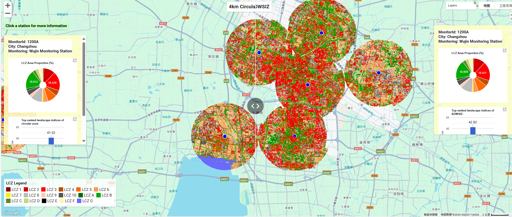
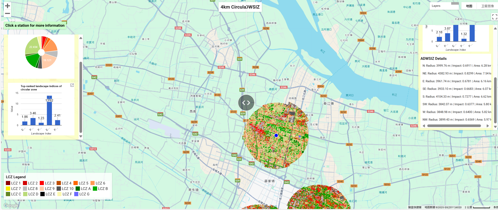

# Quantifying Anisotropic Impacts of LCZ Landscape Patterns on NO2 Variabilities in the Yangtze River Delta, China

This repository contains the data and code accompanying the research: Quantifying Anisotropic Impacts of LCZ Landscape Patterns on NO2 Variabilities in the Yangtze River Delta, China
##
## Methodology Overview
The framework integrates:

1. **LCZ Classification and Landscape Pattern Index Calculation**: Utilizes Landsat-8 imagery for high-precision LCZ classification and computes multi-scale landscape pattern indices to quantify urban morphological characteristics.
2. **Semivariogram Analysis**: Scientifically determines the optimal representation scale (distance and shape) of static LCZ landscape patterns, providing a data-driven baseline for subsequent analysis.
3. **Multi-Scale Geographically Weighted Ridge Regression (GWRR)**: Employs the GWRR model to identify the optimal process scale for explaining NO2 concentrations, effectively mitigating multicollinearity issues and revealing the spatial heterogeneity of landscape pattern impacts on NO2.
4. **Adaptive Directional Weighted Sector Influence Zone (ADWSIZ) Optimization**: Introduces the ADWSIZ model based on GWRR coefficients to dynamically optimize the shape of influence zones, adapting to the spatial heterogeneity of landscape functions, thereby significantly improving model explanatory power.

## Data Source
1.**NO2 Data and landscape_metrics**: Annual means from 179 stations (2024), sourced from [China National Environmental Monitoring Center]((https://www.cnemc.cn)). After calculating the landscape pattern indices via raster clipping, they were merged into the station file[`datas/station.shp`](datas/station.shp)

2.**Landsat-8**:  Landsat-8 OLI, available from the U.S. Geological Survey (USGS), sourced from [Google Earth Engine (GEE)](https://developers.google.com/earth-engine/datasets/catalog/LANDSAT_LC08_C02_T1_L2)

3.**Local Climate Zone (LCZ) Classification**: High-accuracy LCZ maps (30 m spatial resolution) of the YRD urban agglomeration were derived from Landsat-8 OLI imagery. File:[LCZ_yrd_30m.tif](https://drive.google.com/file/d/11588PKhp9D6a_Wma4iC9Tq2nytvb13We/view?usp=sharing)

  
## Step
The workflow is broken down into five main steps, from initial data processing and classification to the final model construction and comparison. The programs, languages, and platforms used are detailed within each step.

### Step 1: Local Climate Zone (LCZ) Classification
* **Platform**: Google Earth Engine (GEE)
* **Code**: [codes/LCZ classfication.js](codes/LCZclassfication.js)
The first step is to generate an LCZ map for the study area. Ground truth samples are uploaded to GEE. We then process **Landsat-8 imagery**, applying cloud and fog filtering to create a clean annual mean composite. Using these samples and the processed imagery, a **random forest algorithm** is trained and applied to classify the Local Climate Zones for the entire Yangtze River Delta (YRD) region.

---

### Step 2: Delineating Influence Zones and Calculating Landscape Metrics
* **Platforms**: Python (VSCode), Fragstats 4.2-64
* **Code**: [codes/clip zone.py](codes/clipzone.py)

Next, we define and analyze the areas surrounding each monitoring station. The LCZ raster map from Step 1 is clipped to create multiple "influence zones" for each station. For instance, for each of the **179 stations**, we generate circular zones with radii increasing from 1000m to 6000m in 500m increments, resulting in 2,148 raster files. This clipping process is automated using a Python script.These clipped rasters are then batch-processed in **Fragstats 4.2** to calculate a suite of landscape pattern indices for each zone.

---

### Step 3: Semivariogram Analysis for Spatial Structure
* **Platform**: Python (VSCode)
* **Code**: [codes/semivariogram.py](codes/semivariogram.py)

To understand the spatial structure and directionality (anisotropy) of the landscape, we perform semivariogram analysis. A stratified sampling strategy is applied to the original LCZ raster. Both standard and directional semivariograms are then calculated on these samples using a Python environment to reveal patterns in spatial autocorrelation.

---

### Step 4: Geographically Weighted Ridge Regression (GWRR) Modeling
* **Platform**: Python
* **Code**: [codes/GWRR.py](codes/GWRR.py)

With the landscape metrics for each influence zone calculated, we build GWRR models. This step allows us to explore the relationship between landscape patterns and the variable of interest (e.g., air pollution) at a local level. By running the model for each of the circular zones created in Step 2, we can identify the optimal "process scale"—the radius at which the landscape has the strongest influence.

---

### Step 5: Constructing the Anisotropy-Directional Weighted Source Influence Zone (ADWSIZ)
* **Platforms**: Python, Fragstats 4.2-64
* **Code**: [codes/ADWSIZ.py](codes/ADWSIZ.py)

The final step is to create a more realistic, adaptive influence zone that accounts for directional effects. Based on the formulas in the paper, we calculate the net influence in eight different directions for each station. The radius of each directional sector is then adjusted based on this influence and the optimal process scale determined in Step 4, while maintaining an equal total area.

## GEE App Link

We have published a public Google Earth Engine (GEE) app that serves as an interactive demonstration of our findings. This tool allows you to visually compare the LCZ results of the **4000 m circular influence zone model** with our proposed **Adaptive Directionally Weighted Sector Influence Zone (ADWSIZ) model**. 

**Interactive App**: [Click here to launch the GEE App](https://ee-l2892786691.projects.earthengine.app/view/adwsiz-vs-circle)

